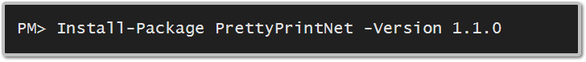

PrettyPrint.NET
==============

Human friendly, textual representations of date, time, duration, file size and transfer rate using standard .NET types.

Install
=======
To install PrettyPrint.NET, run the following command in the [Package Manager Console](http://docs.nuget.org/docs/start-here/using-the-package-manager-console) or go to the [NuGet site](https://www.nuget.org/packages/PrettyPrintNet/) for the complete relase history.

Build Targets:
* .NET 3.5 Client
* Silverlight 4
* WinRT / .NET Core 4.5
* Portable Class Library (.NET 4.0 + Silverlight 4 + Windows Phone 7 + Xbox 360)

Features
========
* TimeSpan 
* File size
 
To be Added
===========
* Transfer rate
* Money
* More cultures and translations
* Pretty print of units of measure in [Units.NET](https://www.nuget.org/packages/UnitsNet/), such as length, mass and force.
